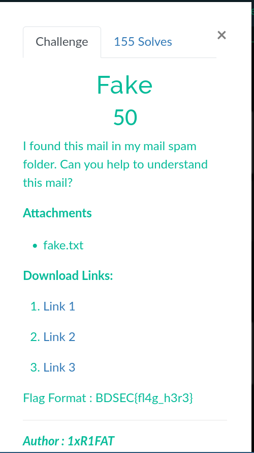
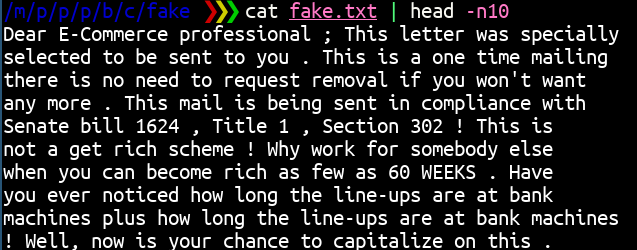
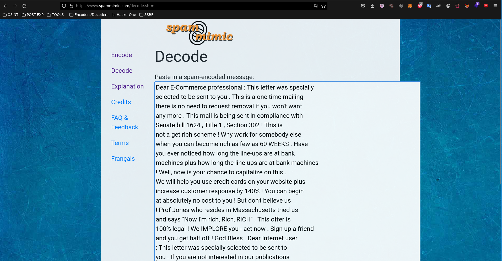
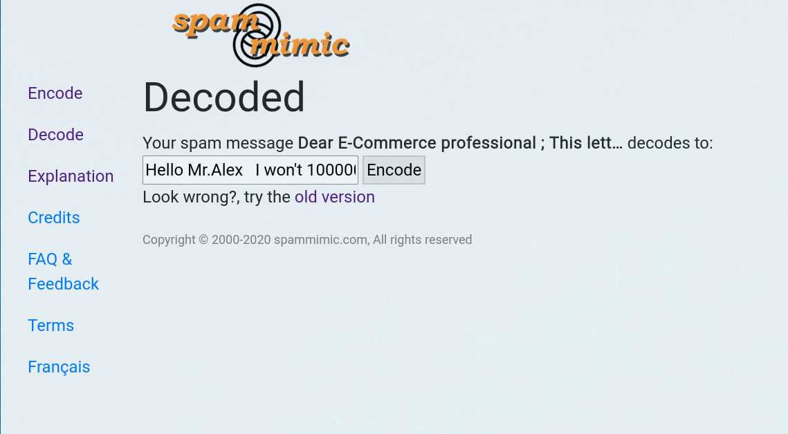

# Fake CTF BDSEC-2022 WRITEUP

The first message we see in order to start our search for the flag is from the image below

 
now downloading the fake.txt file, filtering only by the first 10 lines, I copied and googled it, and I saw right away that it wasn't heavy encryption

 
in one of the forums I ended up coming across a spamming decoder, so I copied all the text that was in it to decode the message
URL: https://www.spammimic.com/decode.shtml
 

I threw the text and then I ended up being able to decode and get the flag

Hello Mr.Alex   I won't 100000 M USD dolor. Can  you want that, you need this key   BDSEC{do3sn't_b3li3ve_1n_unkn0wn_mail} 

# References
https://korben.info/codez-vos-emails-en-spam.html
