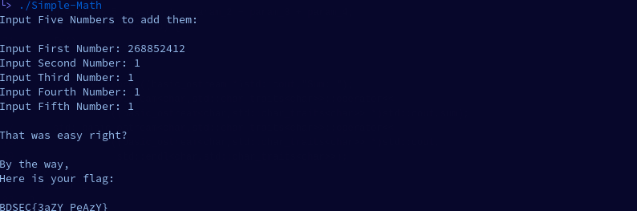

# Simple Math

## Informations

* Description: Can you get the flag from the following?
* File: Simple-Math
* Flag Format: BDSEC{Fl4g_h3r3}
* Author: marufmurtuza

## Getting the flag

I opened the "Flag-Box" file using Ghidra.

Functions:

```
0x0101439 main
0x0101370 comp
0x010119 fg
```

main function:

```

int main()

{
  int fifth_num;
  int fourth_num;
  int third_num;
  int second_num;
  int first_num;
  
  std::operator<<((basic_ostream *)std::cout,"Input Five Numbers to add them:\n\n");
  std::operator<<((basic_ostream *)std::cout,"Input First Number: ");
  std::basic_istream<char,std::char_traits<char>>::operator>>
            ((basic_istream<char,std::char_traits<char>> *)std::cin,&first_num);
  std::operator<<((basic_ostream *)std::cout,"");
  std::operator<<((basic_ostream *)std::cout,"Input Second Number: ");
  std::basic_istream<char,std::char_traits<char>>::operator>>
            ((basic_istream<char,std::char_traits<char>> *)std::cin,&second_num);
  std::operator<<((basic_ostream *)std::cout,"");
  std::operator<<((basic_ostream *)std::cout,"Input Third Number: ");
  std::basic_istream<char,std::char_traits<char>>::operator>>
            ((basic_istream<char,std::char_traits<char>> *)std::cin,&third_num);
  std::operator<<((basic_ostream *)std::cout,"");
  std::operator<<((basic_ostream *)std::cout,"Input Fourth Number: ");
  std::basic_istream<char,std::char_traits<char>>::operator>>
            ((basic_istream<char,std::char_traits<char>> *)std::cin,&fourth_num);
  std::operator<<((basic_ostream *)std::cout,"");
  std::operator<<((basic_ostream *)std::cout,"Input Fifth Number: ");
  std::basic_istream<char,std::char_traits<char>>::operator>>
            ((basic_istream<char,std::char_traits<char>> *)std::cin,&fifth_num);
  std::operator<<((basic_ostream *)std::cout,"");
  comp(first_num,second_num,third_num,fourth_num,fifth_num);
  return 0;
}
```

comp function:

```
void comp(int param_1,int param_2,int param_3,int param_4,int param_5)

{
  int sum;
  
  sum = param_5 + param_1 + param_2 + param_3 + param_4;
  if (sum == 0x10065cc0) {
    fg();
  }
  else {
    std::operator<<((basic_ostream *)std::cout,"Sum: ");
    std::basic_ostream<char,std::char_traits<char>>::operator<<
              ((basic_ostream<char,std::char_traits<char>> *)std::cout,sum);
    std::basic_ostream<char,std::char_traits<char>>::operator<<
              ((basic_ostream<char,std::char_traits<char>> *)std::cout,
               std::endl<char,std::char_traits<char>>);
  }
  return 0;
}
```

If the sum of the 5 numbers is equal to "0x10065cc0", it will jump to "fg()". Decoding this value, the result is 268852416.

Sum of the 5 fields:
```
sum = param_5 + param_1 + param_2 + param_3 + param_4;
```

There are 5 fields, one of them we will use to fill in a specific value, so we have 4 fields left. If the compared value is equal to 268852416, we just have to do a calculation:

268852416 - 4 = 268852412

The first field will have the value 268852412, while the rest will be just added 1.



Flag: BDSEC{3aZY_PeAzY}
